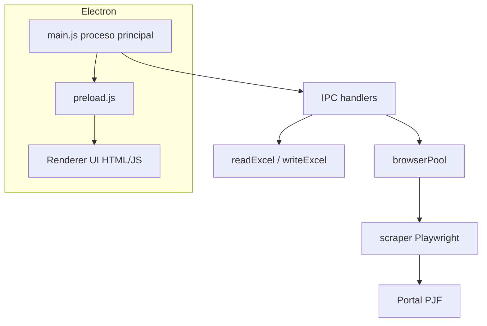

# Arquitectura del proyecto

## Vista general

## Proceso principal (`main.js`)

- Crea la ventana (`BrowserWindow`), carga la UI (`src/ui/index.html`).
- Registra manejadores **IPC**: abrir Excel, cargar datos, ejecutar revisión, abrir carpeta de descargas, etc.
- Lee credenciales desde **variables de entorno** (archivo `.env`).
- Al ejecutar la revisión, llama a **`runPool`** con la lista de expedientes y callbacks de progreso y actualización de filas.

## Preload y renderer

- **Context isolation** activada; el renderer no tiene `nodeIntegration`.
- El preload expone una API segura al HTML/JS de la interfaz para diálogos, logs y progreso.

## Excel

- **Lectura:** `src/excel/readExcel.js` (ExcelJS): construye la lista de expedientes (circuito, órgano, tipo, número, índice de fila).
- **Escritura:** `src/excel/writeExcel.js` actualiza columnas de estado y fecha en la hoja y guarda el workbook.

## Automatización del portal

- **`src/bot/scraper.js`:** orquesta login, búsqueda por expediente y extracción de datos con **Playwright**.
- **`src/utils/browserPool.js`:** procesamiento **secuencial** de expedientes (un expediente tras otro). Decide cuándo actualizar el Excel según el resultado (por ejemplo no escribir en casos `SIN RESULTADOS` o errores, según la lógica actual).
- **`src/utils/playwrightBundled.js`:** en la aplicación **empaquetada** (`app.isPackaged`), resuelve la ruta al Chromium incluido en `resources/playwright-browsers`. En desarrollo devuelve `null` y Playwright usa su instalación habitual.

## Flujo de una revisión

1. Usuario selecciona archivo Excel → se parsean expedientes.
2. Por cada expediente, el scraper abre el navegador (o reutiliza según implementación), inicia sesión si aplica y consulta el portal.
3. Los resultados se vuelcan en el worksheet vía `actualizarFila` cuando corresponde.
4. Al finalizar, se guarda el Excel en la ruta configurada en `main.js` (típicamente carpeta Descargas).

## Dependencias relevantes

- **Electron:** shell de escritorio.
- **Playwright:** automatización del navegador (Chromium).
- **ExcelJS:** lectura/escritura Excel con preservación de formato.
- **dotenv:** carga de `.env`.
